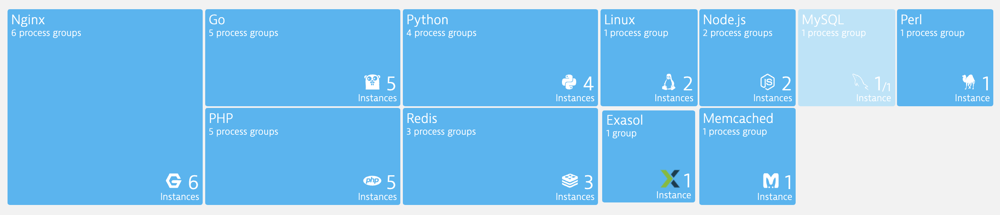
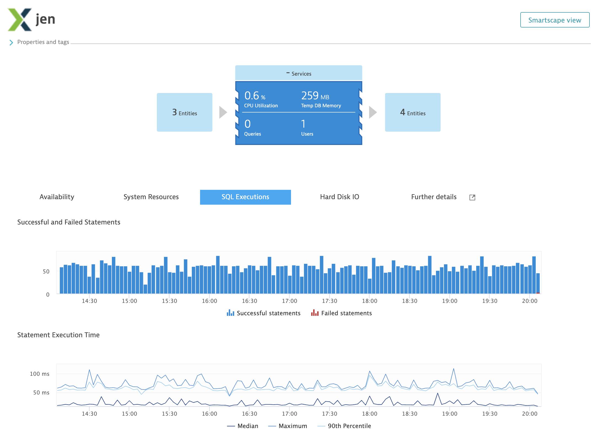
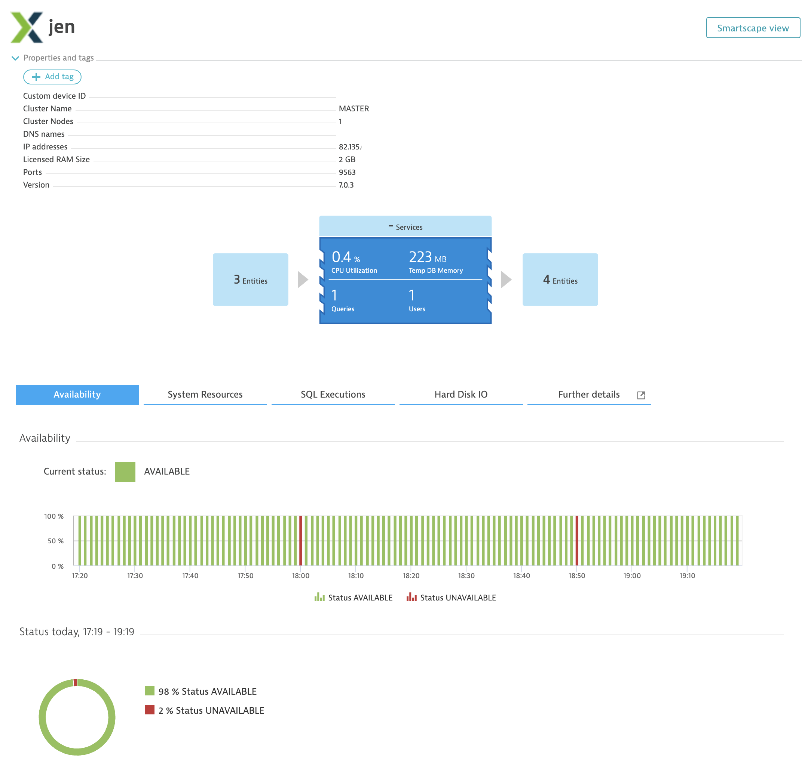
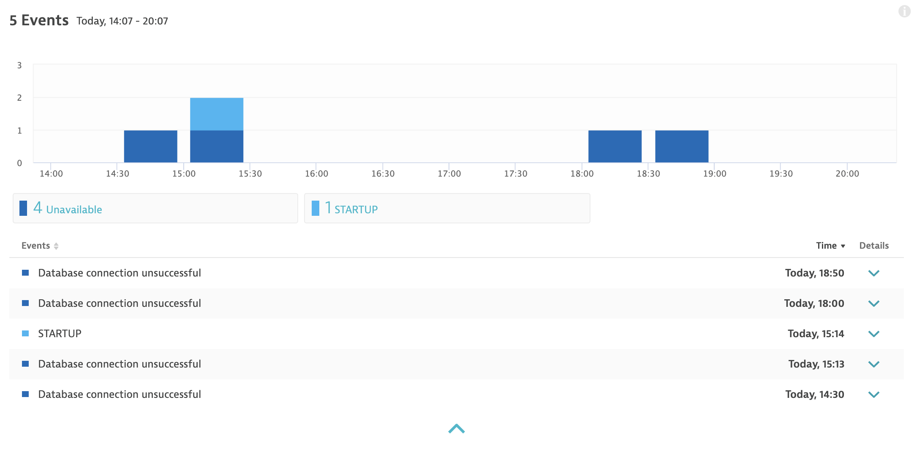
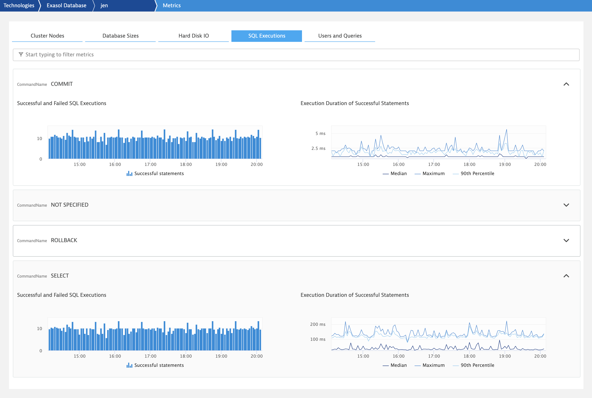
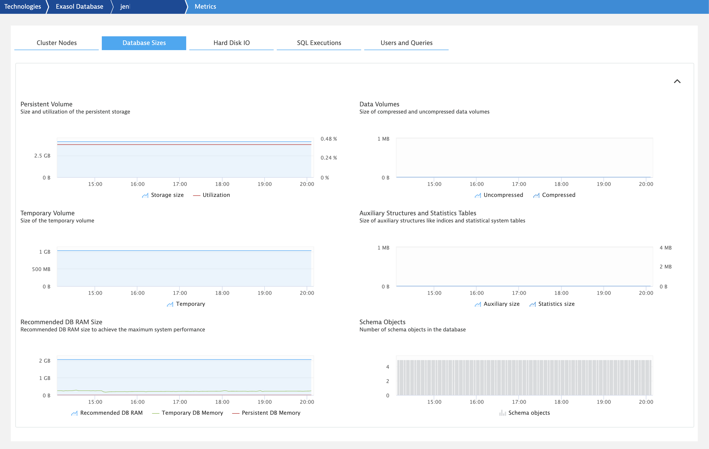

# A Dynatrace Remote Plugin to Monitor Exasol Databases
This is a Active Gate remote plugin that allows the monitoring of the [Exasol Analytics Database](https://www.exasol.com/). It solely uses the statistics and metadata tables provided by Exasol to gather information.

## Dependencies
This plugin depends on the [Exasol Python Database Connector](https://github.com/florian-reck/ExasolDatabaseConnector) which in turn depends on the [unixodbc](http://www.unixodbc.org/) library. As the unixodbc library is a native library it must be present on your Active Gate system.
Note: I have only developed and tested this on Linux Systems.

## What's included
Currenlty I've implemented a few metrics I thought useful by fetching them from various exasol [statistical system tables](https://docs.exasol.com/sql_references/metadata/statistical_system_table.htm#Statistical_System_Tables). This approach is generic enough to add more information or eventually also implement more complex processing of this data (e.g. to implement best practices for health notification). One such best practice has been added for the swap metric (swapping is never ideal for In-Memory DBs :-)

Also included is a scraping of the events table so that Dynatrace can process information about certain DB events (like STARTUP, SHUTDOWN, BACKUP started/stopped, ...)

The availability is also reported based on the successful connection from the AG to the database.

### Installation
Please follow the standard pocess to deploy Active Gate remote plugins as described [here](https://www.dynatrace.com/support/help/extend-dynatrace/extensions/activegate-extensions/write-your-first-activegate-plugin/) 

### Screenshots

After the plugin installation and configuration of your exasol database connection for the plugin you will find the Exasol extension in the Technology overview:

The plugin will immediatley collect data about the instance:

The availability is based on if a successful ODBC connection can be made or not:

The plugin also gets information about traced DB events. Please note that this might not provide 100% accurate timing information as the plugin is only querying this every minute and is not considering events in the past. Therefore especially the SHUTDOWN or STARTUP events might be missed if the DB is shutdown and not reachable this event might not show up. Other events should all show fine.

Stats about the execution of different SQL statments are collected and split by statement type. The timing information on statements is also gathered from the statistics tables and might be differnt than any timings collected on PurePaths (on the client side).

These are the cluster level storage sizes of the DB.

